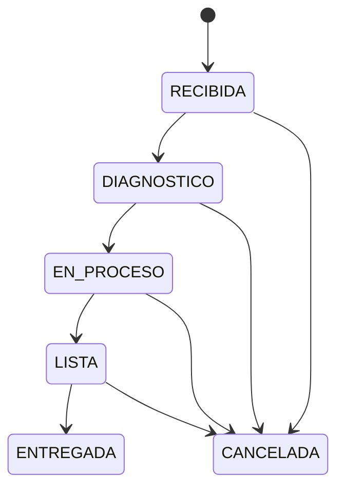

# Business Rules

## Status

These rules are the approved domain contract. HITO 1 enforces persistence-level enums, item bounds and defaults only. Transition orchestration, total recalculation and authorization remain assigned to their later milestones.

## Work-order state machine



Canonical transition map:

```javascript
{
  RECIBIDA: ['DIAGNOSTICO', 'CANCELADA'],
  DIAGNOSTICO: ['EN_PROCESO', 'CANCELADA'],
  EN_PROCESO: ['LISTA', 'CANCELADA'],
  LISTA: ['ENTREGADA', 'CANCELADA'],
  ENTREGADA: [],
  CANCELADA: [],
}
```

- `ENTREGADA` and `CANCELADA` are terminal.
- ADMIN rollback from `ENTREGADA` is optional in the source and deliberately excluded.
- Invalid transitions return HTTP 400 with a clear application error.
- A same-state request is rejected and never creates history.

## Audit history

- Final Phase 2 work-order creation atomically records `NULL -> RECIBIDA` with the authenticated creator.
- Every valid later transition creates exactly one immutable history row in the same transaction.
- Cancellation is audited.
- Rejected and idempotent transitions create no row.
- History is ordered by `created_at DESC, id DESC`.
- History defaults to page 1 and page size 20; page size is capped at 100.
- An indexed query and a test with more than 100 events support the source `<1s` display target under assessment-scale local data.

## Work-order items

```text
type in MANO_OBRA | REPUESTO
count > 0
unitValue >= 0
```

Item mutation and total recalculation are atomic and lock the work order against competing total mutations.

HITO 1 enforces `count > 0` and `unitValue >= 0` in both Sequelize model validation and named MySQL CHECK constraints; it does not yet implement item mutation workflows.

## Total

```text
total = SUM(item.count * item.unitValue)
```

The backend is authoritative. The frontend may display a preview but cannot submit an authoritative persisted total. SQL `DECIMAL` and safe arithmetic avoid floating-point loss.

Example:

```text
2 * 50,000 + 1 * 30,000 = 130,000
```

## Plate normalization

Plate values are trimmed, uppercased and stripped of unnecessary spaces before storage/search. Uniqueness is enforced in the application and database. No Colombian-format regex is assumed.

## Role matrix

| Action | ADMIN | MECANICO |
|---|---:|---:|
| Read clients/bikes/orders | Yes | Yes |
| Create clients/bikes/orders | Yes | No |
| Create items | Yes | Yes |
| Delete items | Yes | No |
| Move to `DIAGNOSTICO` | Yes | Yes |
| Move to `EN_PROCESO` | Yes | Yes |
| Move to `LISTA` | Yes | Yes |
| Move to `ENTREGADA` | Yes | No |
| Move to `CANCELADA` | Yes | No |
| View history | Yes | Yes |
| Administer users | Yes | No |

All business endpoints require authentication in Phase 2. UI hiding is not an authorization boundary.

## Authentication rules

- Inactive users cannot authenticate.
- Login errors are generic.
- Passwords use bcrypt with cost at least 10.
- Passwords and hashes never appear in responses.
- Access JWTs are short-lived.
- Refresh tokens are HttpOnly, persisted only as digests, rotated and revocable.
- Reuse of a rotated token revokes its active token family and returns 401.
