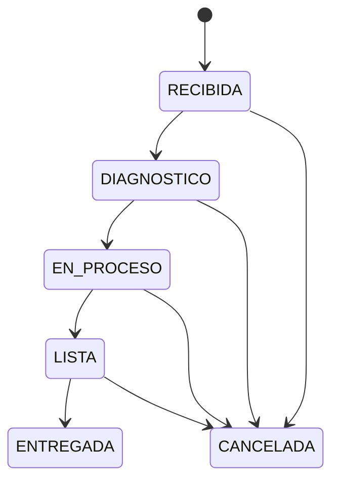

# Business Rules

## Status

These rules are the approved domain contract. HITO 4 implements WorkOrder item mutation and authoritative total recalculation over the existing creation/read behavior. Transition orchestration and authorization remain assigned to later milestones.

## Work-order state machine



Canonical transition map:

```javascript
{
  RECIBIDA: ['DIAGNOSTICO', 'CANCELADA'],
  DIAGNOSTICO: ['EN_PROCESO', 'CANCELADA'],
  EN_PROCESO: ['LISTA', 'CANCELADA'],
  LISTA: ['ENTREGADA', 'CANCELADA'],
  ENTREGADA: [],
  CANCELADA: [],
}
```

- `ENTREGADA` and `CANCELADA` are terminal.
- ADMIN rollback from `ENTREGADA` is optional in the source and deliberately excluded.
- Invalid transitions return HTTP 400 with a clear application error.
- A same-state request is rejected and never creates history.

## Work-order creation

- A valid existing Bike is required; the database FK remains the final integrity barrier.
- `entryDate` accepts an unambiguous ISO 8601 date-time with timezone and defaults to current server time when omitted.
- Every HITO 3 order starts in `RECIBIDA` with persisted total `0.00`.
- Client-supplied `status`, `total`, IDs and timestamps are ignored through explicit whitelists.
- Initial `NULL -> RECIBIDA` history remains deferred until authenticated audit history is implemented in HITO 9.

## Audit history

- Final Phase 2 work-order creation atomically records `NULL -> RECIBIDA` with the authenticated creator.
- Every valid later transition creates exactly one immutable history row in the same transaction.
- Cancellation is audited.
- Rejected and idempotent transitions create no row.
- History is ordered by `created_at DESC, id DESC`.
- History defaults to page 1 and page size 20; page size is capped at 100.
- An indexed query and a test with more than 100 events support the source `<1s` display target under assessment-scale local data.

## Work-order items

```text
type in MANO_OBRA | REPUESTO
count > 0
unitValue >= 0
```

Both item types can be created through `POST /api/work-orders/:id/items`. In the current pre-auth Phase 1 API, items can be deleted through `DELETE /api/work-orders/items/:itemId`; HITO 8 will restrict deletion to ADMIN without changing this domain operation.

Inputs accept at most two decimal places and are normalized to fixed-scale decimal strings. `count` must fit `DECIMAL(10,2)` and `unitValue` must fit `DECIMAL(15,2)`. HITO 1 model validation and named MySQL CHECK constraints remain the persistence barriers.

Item mutation and total recalculation are atomic. The owning WorkOrder row is locked with `FOR UPDATE`, and the mutation, aggregate and stored total either all commit or all roll back. A deletion revalidates the item after acquiring the order lock so a concurrent change cannot produce a stale total.

## Total

```text
total = SUM(item.count * item.unitValue)
```

The backend is authoritative. The frontend may display a preview but cannot submit an authoritative persisted total. MySQL evaluates the aggregate with `DECIMAL`, casts the final value to `DECIMAL(15,2)` and returns a string; JavaScript `Number` is never used for monetary calculation. Deleting the final item produces `0.00`.

Example:

```text
2 * 50,000 + 1 * 30,000 = 130,000
```

## Plate normalization

Plate values are trimmed, uppercased and stripped of unnecessary spaces before storage/search. Uniqueness is enforced in the application and database. No Colombian-format regex is assumed.

## Role matrix

| Action | ADMIN | MECANICO |
|---|---:|---:|
| Read clients/bikes/orders | Yes | Yes |
| Create clients/bikes/orders | Yes | No |
| Create items | Yes | Yes |
| Delete items | Yes | No |
| Move to `DIAGNOSTICO` | Yes | Yes |
| Move to `EN_PROCESO` | Yes | Yes |
| Move to `LISTA` | Yes | Yes |
| Move to `ENTREGADA` | Yes | No |
| Move to `CANCELADA` | Yes | No |
| View history | Yes | Yes |
| Administer users | Yes | No |

All business endpoints require authentication in Phase 2. UI hiding is not an authorization boundary.

## Authentication rules

- Inactive users cannot authenticate.
- Login errors are generic.
- Passwords use bcrypt with cost at least 10.
- Passwords and hashes never appear in responses.
- Access JWTs are short-lived.
- Refresh tokens are HttpOnly, persisted only as digests, rotated and revocable.
- Reuse of a rotated token revokes its active token family and returns 401.
