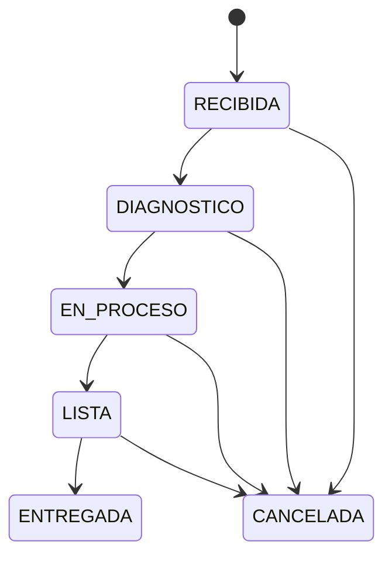

# Reglas de negocio

## Estado

Este documento es el contrato de dominio implementado para las fases 1 y 2 y
los hitos de productización aprobados hasta HITO 7.

## Máquina de estados de la orden



Mapa canónico:

```javascript
{
  RECIBIDA: ['DIAGNOSTICO', 'CANCELADA'],
  DIAGNOSTICO: ['EN_PROCESO', 'CANCELADA'],
  EN_PROCESO: ['LISTA', 'CANCELADA'],
  LISTA: ['ENTREGADA', 'CANCELADA'],
  ENTREGADA: [],
  CANCELADA: [],
}
```

| Estado actual | Destinos permitidos |
|---|---|
| `RECIBIDA` | `DIAGNOSTICO`, `CANCELADA` |
| `DIAGNOSTICO` | `EN_PROCESO`, `CANCELADA` |
| `EN_PROCESO` | `LISTA`, `CANCELADA` |
| `LISTA` | `ENTREGADA`, `CANCELADA` |
| `ENTREGADA` | ninguno |
| `CANCELADA` | ninguno |

- `ENTREGADA` y `CANCELADA` son terminales.
- El rollback de `ENTREGADA` para `ADMIN` era opcional y se excluye deliberadamente.
- Un destino desconocido falla en validación; una arista conocida pero inválida devuelve HTTP 400 con `INVALID_STATUS_TRANSITION`.
- Solicitar el mismo estado se rechaza y nunca crea historial.
- La orden se bloquea en una transacción y se valida desde el estado leído bajo lock.
- `note` es opcional, se recorta, admite máximo 1000 caracteres y sólo se persiste para una transición válida.

## Creación y unicidad de órdenes abiertas

- Sólo `ADMIN` crea órdenes.
- Requiere una `Bike` activa con propietario activo; el servicio bloquea `Client → Bike`.
- Una motocicleta admite máximo una orden en `RECIBIDA`, `DIAGNOSTICO`, `EN_PROCESO` o `LISTA`. Lock de moto más `uq_work_orders_open_bike` protegen la invariancia bajo concurrencia.
- `assignedMechanicId` es opcional; si existe, bloquea `User` después de la moto y exige un `MECANICO` activo.
- `entryDate` acepta ISO 8601 con zona horaria; si se omite, usa la hora del servidor.
- Toda orden API inicia en `RECIBIDA`, total `0.00`.
- `status`, `total`, IDs y timestamps enviados por el cliente se ignoran mediante allowlists.
- Orden, history `NULL -> RECIBIDA` y audit `CREATED` son atómicos; la asignación inicial vive en el snapshot y no duplica un evento `ASSIGNED`.

## Responsable mecánico

- `assigned_mechanic_id` representa cero o un responsable; `null` mantiene la orden visible como no asignada.
- Sólo `ADMIN` usa `PATCH /work-orders/:id/assignment`.
- Sólo un usuario activo con rol `MECANICO` puede ser destino.
- Una orden cerrada rechaza cambios con `409 WORK_ORDER_CLOSED`.
- Asignación inicial `null → mechanic` no exige razón y audita `ASSIGNED`.
- Reasignación `mechanic A → mechanic B` exige razón y audita `REASSIGNED`.
- Unassignment `mechanic → null` exige razón y audita `UNASSIGNED`.
- La misma asignación se rechaza como no-op y nunca audita.
- Los usuarios se bloquean por ID ascendente antes de la orden; toda decisión se revalida después de los locks.
- Las respuestas/listas muestran ID y datos seguros del responsable; `assignedMechanicId` también filtra por responsable exacto.
- Ownership de lectura/mutación para `MECANICO` y scopes `mine/unassigned` se activan en HITO 9.

## Historial de estados

- Cada transición válida, incluida cancelación, agrega exactamente una fila inmutable.
- Intentos inválidos, idempotentes o sin permiso no agregan filas.
- El orden es `created_at DESC, id DESC`.
- La página predeterminada es 1/20 y el máximo es 100.
- Una orden inexistente devuelve 404, no una lista ambigua vacía.
- Ambos roles pueden consultar; el actor expone sólo ID y nombre.
- No existen endpoints de update/delete para historial.

## Auditoría empresarial global

- `work_order_status_history` conserva la secuencia especializada de estados; no es reemplazado por `audit_events`.
- Las altas autenticadas de cliente, motocicleta, usuario y orden, los cambios de asignación, el alta de ítem y las transiciones/cancelaciones existentes generan un solo evento empresarial específico.
- El evento se escribe en la misma transacción que el dominio. Si falla, toda la mutación revierte; intentos inválidos o sin permiso no auditan.
- El actor siempre es el usuario autenticado y no se acepta desde el body.
- `beforeData`, `afterData` y `metadata` tienen allowlists por entidad/acción; IDs, fechas y decimales usan representaciones deterministas.
- Sólo `ADMIN` consulta la colección/detalle con filtros y paginación acotados. No existen endpoints normales para actualizar o eliminar eventos.

## Lifecycle de clientes

- Teléfono se canonicaliza retirando espacios, guiones, puntos y paréntesis; conserva un único `+` inicial y exige entre 7 y 20 dígitos. Email usa trim/lowercase. No se infiere país.
- Nombre nunca es clave duplicada. Coincidencias exactas activas de phone/email devuelven `409 CLIENT_DUPLICATE_RISK`; el override exige `confirmDuplicate: true` y `duplicateReason`.
- Una coincidencia eliminada devuelve `409 CLIENT_RESTORE_REQUIRED` y no admite override de creación/update.
- Listado usa lifecycle `active` por defecto y paginación 1/20, máximo 100. Sólo ADMIN consulta `deleted/all` o detalle eliminado.
- Sólo ADMIN crea, actualiza, elimina y restaura. Un eliminado es read-only hasta restore.
- Delete lógico exige reason y se bloquea con `409 CLIENT_HAS_ACTIVE_BIKES` mientras exista una moto activa. Nunca elimina físicamente relaciones.
- Restore exige reason, limpia los tres campos lifecycle y no restaura motos. Si colisiona con un cliente activo requiere override justificado.
- Create/update/delete/restore y sus eventos audit se confirman o revierten en una transacción. Delete y creación de moto comparten el lock del cliente para evitar un propietario eliminado con moto activa.

## Ítems de orden

```text
type in MANO_OBRA | REPUESTO
count > 0
unitValue >= 0
```

Ambos roles pueden crear ítems. Sólo `ADMIN` puede eliminarlos; `MECANICO` recibe 403 sin alterar ítem ni total.

Los decimales admiten hasta dos posiciones. `count` cabe en `DECIMAL(10,2)` y `unitValue` en `DECIMAL(15,2)`. La validación de modelo y los CHECK de MySQL son barreras adicionales.

Cada mutación bloquea la orden, modifica el ítem, agrega todos los ítems persistidos y actualiza el total en una sola transacción. La eliminación relee el ítem después del lock para evitar totales obsoletos.

## Total

```text
total = SUM(item.count * item.unitValue)
```

El backend es la autoridad. MySQL calcula con `DECIMAL`, castea a `DECIMAL(15,2)` y devuelve string; no se usa `Number` para dinero. Eliminar el último ítem deja `0.00`.

```text
2 * 50,000 + 1 * 30,000 = 130,000
```

## Normalización de placa

La placa se recorta, convierte a mayúsculas y elimina espacios antes de guardar o buscar. La unicidad global se aplica en servicio y base de datos incluso después del soft delete. `plate` consulta por igualdad exacta y `platePrefix` por prefijo indexable; son excluyentes y nunca se usa wildcard inicial. No se inventa una regex de formato colombiano.

## Lifecycle de motocicletas

- El listado usa `active` por defecto, paginación 1/20 con máximo 100 y filtros por placa exacta, prefijo y propietario. Sólo `ADMIN` consulta `deleted/all` o detalle eliminado.
- Sólo `ADMIN` crea, actualiza, cambia propietario, elimina y restaura. Una eliminada es read-only hasta restore.
- `PATCH /api/bikes/:id` sólo modifica placa, marca, modelo o cilindraje. El propietario cambia exclusivamente por `/owner`, con destino activo y razón obligatoria.
- Owner change preserva el `bikeId` de todas las órdenes y audita `previousClientId → newClientId` bajo locks `Client(s) → Bike`.
- Delete lógico exige razón y devuelve `409 BIKE_HAS_ACTIVE_WORK_ORDER` si existe una orden abierta. Nunca elimina órdenes ni ítems.
- Restore exige razón y dueño activo, conserva placa/propietario/historia y limpia los tres campos lifecycle.
- El detalle entrega propietario y resumen de orden abierta; `GET /work-orders?bikeId=` pagina toda la historia.
- Create/update/owner/delete/restore y sus eventos audit son atómicos. Crear orden y eliminar moto comparten locks de propietario/moto para no dejar una orden operativa sobre un recurso eliminado.

## Matriz RBAC

| Acción | `ADMIN` | `MECANICO` |
|---|:---:|:---:|
| Leer clientes/motocicletas activos y órdenes | Sí | Sí |
| Leer clientes/motocicletas eliminados/all | Sí | No |
| Crear/editar/eliminar/restaurar clientes | Sí | No |
| Crear/editar/cambiar dueño/eliminar/restaurar motocicletas | Sí | No |
| Crear órdenes | Sí | No |
| Asignar/reasignar/dejar sin responsable | Sí | No |
| Crear ítems | Sí | Sí |
| Eliminar ítems | Sí | No |
| Avanzar a `DIAGNOSTICO` | Sí | Sí |
| Avanzar a `EN_PROCESO` | Sí | Sí |
| Avanzar a `LISTA` | Sí | Sí |
| Avanzar a `ENTREGADA` | Sí | No |
| Avanzar a `CANCELADA` | Sí | No |
| Consultar historial | Sí | Sí |
| Consultar auditoría empresarial global | Sí | No |
| Administrar usuarios | Sí | No |

Todos los endpoints de negocio exigen autenticación. Para estados, primero se valida la arista bajo lock: una arista inválida es 400; una arista válida pero prohibida al actor es 403. La UI no es frontera de autorización.

La auto-desactivación y el cambio del propio rol están permitidos. El access token afectado falla en la siguiente petición. Preservar un último `ADMIN` queda fuera de este MVP.

## Reglas de autenticación

- usuarios inactivos no autentican;
- login usa un error genérico;
- bcrypt usa coste entre 10 y 15;
- contraseñas y hashes nunca salen en respuestas;
- access JWT es de vida corta;
- refresh JWT sólo viaja en cookie `HttpOnly` y se persiste como digest;
- cada refresh rota y revoca al predecesor;
- reutilizar un token rotado revoca su familia activa y devuelve 401;
- cada login inicia una familia independiente;
- `/auth/me` recarga al usuario y aplica cambios de rol/activo inmediatamente;
- refresh concurrente se serializa con row lock y trata el segundo uso como posible replay.
