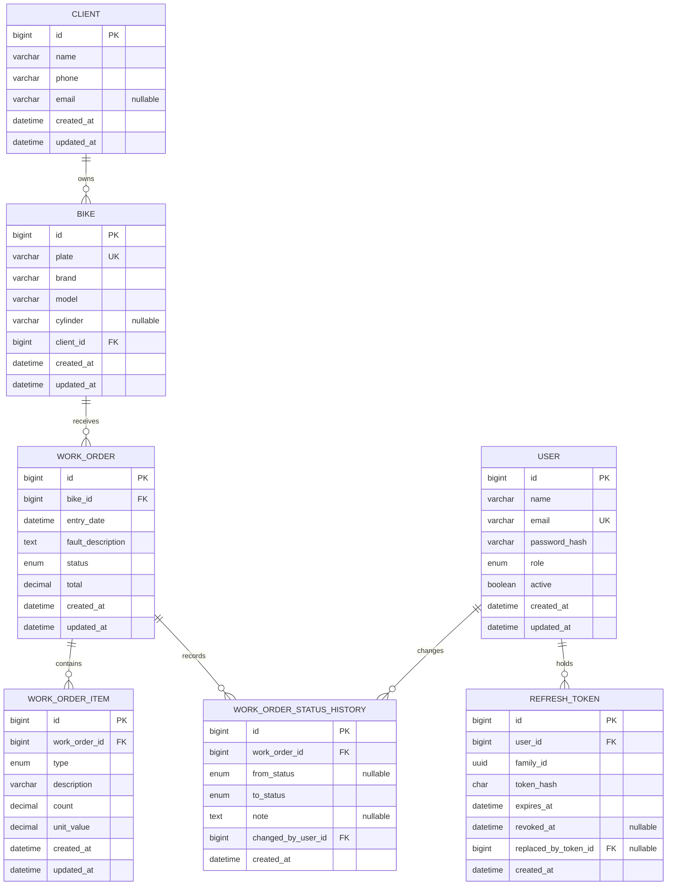

# Database Model

## Status

This is the approved conceptual target model. HITO 0 does not create domain models, tables or migrations. Physical types are finalized in the corresponding schema milestones.

## Conventions

- MySQL 8 and InnoDB.
- `snake_case` table and column names.
- Numeric primary keys.
- Foreign keys enforced by the database.
- Money stored with a suitable `DECIMAL`, never binary floating point.
- Schema changes applied only through deterministic migrations.
- Timestamps stored consistently and exposed as ISO 8601 values.

## Entity relationship diagram



Conceptual types do not substitute for migrations. For example, the exact precision of money and count is decided and tested in HITO 1.

## Client

| Column | Conceptual type | Rules |
|---|---|---|
| `id` | BIGINT | PK |
| `name` | VARCHAR | required |
| `phone` | VARCHAR | required |
| `email` | VARCHAR | nullable |
| `created_at` | DATETIME | required |
| `updated_at` | DATETIME | required |

Relationship: one client owns many bikes.

## Bike

| Column | Conceptual type | Rules |
|---|---|---|
| `id` | BIGINT | PK |
| `plate` | VARCHAR | required, normalized, UNIQUE |
| `brand` | VARCHAR | required |
| `model` | VARCHAR | required |
| `cylinder` | VARCHAR | nullable |
| `client_id` | BIGINT | FK to `clients.id`, required |
| timestamps | DATETIME | required |

Plate normalization is trim, uppercase and removal of unnecessary spaces. The application checks duplicates and the database unique constraint remains authoritative. No country-specific regex is assumed.

## WorkOrder

| Column | Conceptual type | Rules |
|---|---|---|
| `id` | BIGINT | PK |
| `bike_id` | BIGINT | FK to `bikes.id`, required |
| `entry_date` | DATETIME | required |
| `fault_description` | TEXT | required |
| `status` | ENUM | canonical status values, required |
| `total` | DECIMAL | required, backend-controlled, default zero |
| timestamps | DATETIME | required |

Relationships: one bike has many work orders; one work order has many items and history records.

## WorkOrderItem

| Column | Conceptual type | Rules |
|---|---|---|
| `id` | BIGINT | PK |
| `work_order_id` | BIGINT | FK to `work_orders.id`, required |
| `type` | ENUM | `MANO_OBRA` or `REPUESTO` |
| `description` | VARCHAR/TEXT | required |
| `count` | DECIMAL | greater than zero |
| `unit_value` | DECIMAL | greater than or equal to zero |
| timestamps | DATETIME | required |

## User

| Column | Conceptual type | Rules |
|---|---|---|
| `id` | BIGINT | PK |
| `name` | VARCHAR | required |
| `email` | VARCHAR | normalized, required, UNIQUE |
| `password_hash` | VARCHAR | required, never serialized |
| `role` | ENUM | `ADMIN` or `MECANICO` |
| `active` | BOOLEAN | required |
| timestamps | DATETIME | required |

## WorkOrderStatusHistory

| Column | Conceptual type | Rules |
|---|---|---|
| `id` | BIGINT | PK |
| `work_order_id` | BIGINT | FK to `work_orders.id`, required |
| `from_status` | ENUM | nullable only for initial event |
| `to_status` | ENUM | required |
| `note` | TEXT | nullable |
| `changed_by_user_id` | BIGINT | FK to `users.id`, required |
| `created_at` | DATETIME | required, immutable |

Required index:

```text
(work_order_id, created_at DESC, id DESC)
```

The source-required `(work_order_id, created_at DESC)` prefix is preserved; `id DESC` provides deterministic ordering for timestamp ties. There are no update or delete history endpoints.

Work-order creation in the final Phase 2 system atomically creates `NULL -> RECIBIDA` with the authenticated creator. This interprets the source field “from_status nullable para el primer estado” explicitly and traceably.

## RefreshToken

| Column | Conceptual type | Rules |
|---|---|---|
| `id` | BIGINT | PK |
| `user_id` | BIGINT | FK to `users.id`, required |
| `family_id` | UUID/CHAR | required session-family identifier |
| `token_hash` | CHAR/VARCHAR | deterministic secure digest, required |
| `expires_at` | DATETIME | required |
| `revoked_at` | DATETIME | nullable |
| `replaced_by_token_id` | BIGINT | self-FK, nullable |
| `created_at` | DATETIME | required |

Raw refresh tokens are never persisted. Rotation retains the family identifier. Reuse of a rotated/revoked token revokes active tokens in that family.

## Database environments

Development uses `pavas_workshop`; integration tests use `pavas_workshop_test`. Test setup must refuse production execution and apply migrations to the dedicated test database. See [testing.md](testing.md).

