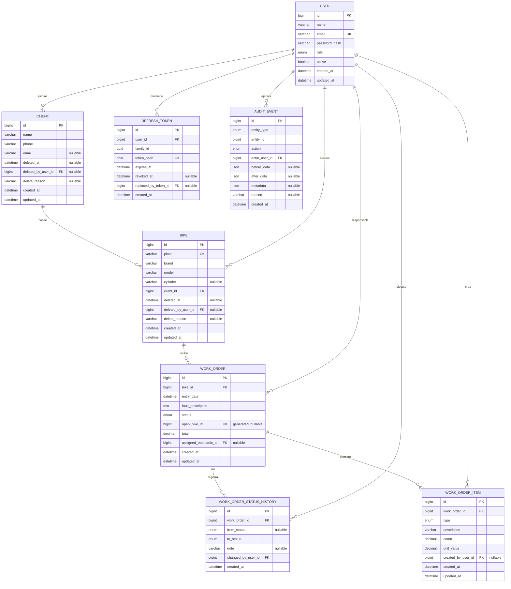

# Base de datos

## Estado

El esquema físico conserva las estructuras de Fases 1 y 2 y añade las
fundaciones de persistencia de productización: lifecycle de clientes/motos,
`audit_events`, responsable de orden y actor de ítem. Catorce migraciones son la
fuente de verdad. HITO 3 activa el lifecycle de clientes y canonicaliza de
forma segura sus contactos; HITO 4 activa el lifecycle y ownership de motos
y las demás capacidades se activan por hito. La reapertura de HITO 11 no agrega
columnas: sus repeticiones se reconstruyen desde `work_order_status_history` y
`audit_events`, evitando un campo mutable de “última reapertura”. HITO 12 activa
la columna de creador ya migrada; tampoco requiere una migración nueva.

## Convenciones

- MySQL 8.4 e InnoDB.
- Tablas y columnas en `snake_case`.
- PK `BIGINT UNSIGNED` autoincrementales.
- FKs y restricciones aplicadas por MySQL.
- Dinero en `DECIMAL(15,2)`; cantidades en `DECIMAL(10,2)`.
- Timestamps en `DATETIME(3)` y salida API ISO 8601.
- Cambios de esquema sólo mediante migraciones deterministas.

## Diagrama entidad-relación



## `clients`

`phone` se almacena sin espacios, guiones, puntos ni paréntesis, conserva como
máximo un `+` inicial y debe cumplir `^\+?\d{7,20}$`. `email` es nullable y,
cuando existe, se almacena con trim/lowercase y formato válido. No hay UNIQUE
en nombre, teléfono o email: los contactos compartidos requieren confirmación
de negocio, no una simplificación física.

| Columna | Tipo | Reglas |
|---|---|---|
| `id` | `BIGINT UNSIGNED` | PK, autoincremental |
| `name` | `VARCHAR(150)` | requerida |
| `phone` | `VARCHAR(30)` | requerida |
| `email` | `VARCHAR(254)` | nullable |
| `deleted_at` | `DATETIME(3)` | nullable; `NULL` significa activo |
| `deleted_by_user_id` | `BIGINT UNSIGNED` | FK nullable a `users` |
| `delete_reason` | `VARCHAR(1000)` | nullable |
| `created_at`, `updated_at` | `DATETIME(3)` | requeridas |

Un cliente posee muchas motocicletas.

`chk_clients_delete_state` exige que los tres campos lifecycle estén todos
nulos o todos informados y que la razón no quede vacía. Los índices
`ix_clients_lifecycle_name_id` e `ix_clients_deleted_by_user` soportan vistas
administrativas e integridad referencial.

## `bikes`

| Columna | Tipo | Reglas |
|---|---|---|
| `id` | `BIGINT UNSIGNED` | PK, autoincremental |
| `plate` | `VARCHAR(20)` | requerida, normalizada, UNIQUE `uq_bikes_plate` |
| `brand` | `VARCHAR(100)` | requerida |
| `model` | `VARCHAR(100)` | requerida |
| `cylinder` | `VARCHAR(50)` | nullable |
| `client_id` | `BIGINT UNSIGNED` | FK `fk_bikes_client`, requerida |
| `deleted_at` | `DATETIME(3)` | nullable; `NULL` significa activa |
| `deleted_by_user_id` | `BIGINT UNSIGNED` | FK nullable a `users` |
| `delete_reason` | `VARCHAR(1000)` | nullable |
| timestamps | `DATETIME(3)` | requeridos |

Setter, service y validador recortan, convierten a mayúsculas y eliminan whitespace. El service hace un pre-check y mapea la violación residual a HTTP 409; el índice UNIQUE es autoritativo.

`chk_bikes_delete_state` aplica la misma coherencia lifecycle. Los índices
`ix_bikes_lifecycle_plate_id` y `ix_bikes_client_lifecycle_plate_id` soportan
las vistas paginadas active/deleted/all, la búsqueda por prefijo de placa y la
relación por propietario. `uq_bikes_plate` permanece global: borrar lógicamente
no libera la placa. El cambio de propietario sólo actualiza `client_id`, por lo
que todas las órdenes conservan la misma identidad `bike_id`. Delete/restore no
eliminan relaciones y se validan bajo locks `Client → Bike → WorkOrder` cuando
la existencia de una orden abierta afecta la operación.

## `work_orders`

| Columna | Tipo | Reglas |
|---|---|---|
| `id` | `BIGINT UNSIGNED` | PK, autoincremental |
| `bike_id` | `BIGINT UNSIGNED` | FK `fk_work_orders_bike`, requerida |
| `entry_date` | `DATETIME(3)` | requerida |
| `fault_description` | `TEXT` | requerida |
| `status` | `ENUM` | seis estados canónicos, requerida |
| `open_bike_id` | `BIGINT UNSIGNED` | generated stored; `bike_id` sólo para estados abiertos, `NULL` para cerrados |
| `total` | `DECIMAL(15,2)` | backend-controlled, default `0.00` |
| `assigned_mechanic_id` | `BIGINT UNSIGNED` | FK nullable a `users` |
| timestamps | `DATETIME(3)` | requeridos |

Una motocicleta tiene muchas órdenes históricas, pero como máximo una abierta;
una orden tiene muchos ítems y eventos. La API fija `RECIBIDA`/`0.00`, aunque
los defaults de DB actúan como defensa adicional. El índice
`uq_work_orders_open_bike` sobre `open_bike_id` impone el máximo de una orden
abierta incluso frente a escrituras concurrentes o callers que omitan el
pre-check del servicio. La columna es interna: no se acepta ni se serializa.

Las órdenes existentes permanecen sin asignar. El índice
`ix_work_orders_assignee_status_entry_id` respalda las consultas My Orders y
Unassigned activadas en HITO 9. Desde HITO 7, el servicio sólo permite destinos activos con rol
`MECANICO`, bloquea usuarios por ID antes de la orden y audita todo cambio de
responsable.

HITO 15 añade tres índices medidos contra las consultas operativas restantes:

- `ix_work_orders_entry_id (entry_date DESC, id DESC)` para la lista All;
- `ix_work_orders_status_entry_id (status, entry_date DESC, id DESC)` para las
  colas del dashboard y filtros por estado;
- `ix_work_orders_bike_entry_id (bike_id, entry_date DESC, id DESC)` para la
  historia paginada de una motocicleta.

El último también satisface la FK por su prefijo `bike_id`; MySQL puede retirar
el índice simple implícito al crearlo. Por eso el `down` de la migración `014`
restaura primero `fk_work_orders_bike` y sólo después elimina el compuesto.
Los tres índices preservan el mismo desempate que la API y no modifican datos.

## `work_order_items`

| Columna | Tipo | Reglas |
|---|---|---|
| `id` | `BIGINT UNSIGNED` | PK, autoincremental |
| `work_order_id` | `BIGINT UNSIGNED` | FK `fk_work_order_items_order`, requerida |
| `type` | `ENUM` | `MANO_OBRA` o `REPUESTO` |
| `description` | `VARCHAR(255)` | requerida |
| `count` | `DECIMAL(10,2)` | CHECK `chk_work_order_items_count_positive` |
| `unit_value` | `DECIMAL(15,2)` | CHECK `chk_work_order_items_unit_value_nonnegative` |
| `created_by_user_id` | `BIGINT UNSIGNED` | FK nullable a `users`; legacy permitido |
| timestamps | `DATETIME(3)` | requeridos |

`DECIMAL(15,2)` admite hasta 13 dígitos enteros y dos decimales. La cantidad permite repuestos discretos y horas fraccionarias sin float binario.

Desde HITO 12, toda alta API fija `created_by_user_id` desde el usuario
autenticado. La nulabilidad preserva filas legacy anteriores a la atribución; no
permite que una petición nueva omita o suplante al actor. El índice
`ix_work_order_items_created_by_user` satisface la FK de forma explícita.

## Consistencia de ítems y total

Cada mutación bloquea la fila de `work_orders` dentro de una transacción. El total se recalcula desde filas persistidas:

```sql
CAST(COALESCE(SUM(`count` * `unit_value`), 0) AS DECIMAL(15,2))
```

`COALESCE` define una orden vacía como `0.00`; mysql2/Sequelize devuelve el
decimal como string. El backend no lo convierte a `Number`. Sólo órdenes
abiertas admiten add/delete. Cada mutación confirma actor, audit y total en la
misma transacción; delete bloquea `WorkOrder → WorkOrderItem`. Consulte
[ADR-004](decisions/ADR-004-server-side-order-total.md).

## `users`

| Columna | Tipo | Reglas |
|---|---|---|
| `id` | `BIGINT UNSIGNED` | PK, autoincremental |
| `name` | `VARCHAR(150)` | requerida |
| `email` | `VARCHAR(254)` | normalizado, UNIQUE `uq_users_email` |
| `password_hash` | `VARCHAR(255)` | requerido, nunca serializado |
| `role` | `ENUM` | `ADMIN` o `MECANICO` |
| `active` | `BOOLEAN` | requerido, default true |
| timestamps | `DATETIME(3)` | requeridos |

El email se recorta y pasa a minúsculas. La administración no modifica el
esquema. Las invariantes del último `ADMIN` activo y del mecánico con órdenes
abiertas dependen de consultas bloqueadas y auditoría transaccional; no pueden
expresarse como un CHECK local de una sola fila.

## `refresh_tokens`

| Columna | Tipo | Reglas |
|---|---|---|
| `id` | `BIGINT UNSIGNED` | PK, autoincremental |
| `user_id` | `BIGINT UNSIGNED` | FK `fk_refresh_tokens_user`, delete RESTRICT |
| `family_id` | `CHAR(36)` | familia UUID de sesión |
| `token_hash` | `CHAR(64)` | SHA-256 digest UNIQUE |
| `expires_at` | `DATETIME(3)` | requerida, indexada |
| `revoked_at` | `DATETIME(3)` | nullable |
| `replaced_by_token_id` | `BIGINT UNSIGNED` | self-FK, nullable, delete SET NULL |
| `created_at` | `DATETIME(3)` | requerida |

Nunca se persiste el token crudo. Rotación conserva `family_id`; replay revoca los tokens activos de esa familia. Los índices `ix_refresh_tokens_family_active`, `ix_refresh_tokens_user_family` e `ix_refresh_tokens_expires_at` apoyan revocación y consulta.

## `work_order_status_history`

| Columna | Tipo | Reglas |
|---|---|---|
| `id` | `BIGINT UNSIGNED` | PK, autoincremental |
| `work_order_id` | `BIGINT UNSIGNED` | FK a `work_orders`, requerida |
| `from_status` | `ENUM` | nullable sólo para el evento inicial |
| `to_status` | `ENUM` | requerida |
| `note` | `VARCHAR(1000)` | nullable |
| `changed_by_user_id` | `BIGINT UNSIGNED` | FK a `users`, requerida |
| `created_at` | `DATETIME(3)` | requerida, inmutable |

Índice:

```text
(work_order_id ASC, created_at DESC, id DESC)
```

Conserva el prefijo pedido por la prueba y añade `id` como desempate determinista. Las FKs de orden/actor usan `ON DELETE RESTRICT`; no existen endpoints de update/delete.

## `audit_events`

| Columna | Tipo | Reglas |
|---|---|---|
| `id` | `BIGINT UNSIGNED` | PK, autoincremental |
| `entity_type` | `ENUM` | catálogo contractual, requerido |
| `entity_id` | `BIGINT UNSIGNED` | identidad polimórfica sin FK |
| `action` | `ENUM` | catálogo contractual, requerido |
| `actor_user_id` | `BIGINT UNSIGNED` | FK `fk_audit_events_actor`, requerida |
| `before_data`, `after_data`, `metadata` | `JSON` | nullable |
| `reason` | `VARCHAR(1000)` | nullable en persistencia |
| `created_at` | `DATETIME(3)` | requerida |

No existe `updated_at`. Los índices por fecha, entidad, actor y acción terminan
en `created_at DESC, id DESC` para paginación determinista. HITO 2 activa
snapshots/metadata con allowlists cerradas, escrituras dentro de la misma
transacción del dominio y lectura paginada exclusiva para `ADMIN`. El
repositorio de audit sólo expone create/read; la API no ofrece update/delete.

## Política referencial

Las FKs operativas usan `ON DELETE RESTRICT`. En general usan
`ON UPDATE CASCADE`; `deleted_by_user_id` usa también `ON UPDATE RESTRICT`
porque MySQL no admite una acción referencial CASCADE sobre una columna
participante de un CHECK. Desde la migración 013, `fk_work_orders_bike` usa
`ON UPDATE RESTRICT`: MySQL tampoco permite `CASCADE` cuando la columna base
`bike_id` participa en la columna generated stored `open_bike_id`. Su `down`
elimina primero la barrera generada y restaura la FK original con `CASCADE`.
Los IDs no se actualizan en el producto. Sólo el self-link opcional de
reemplazo de refresh usa `ON DELETE SET NULL`.

## Migraciones

```text
202608240001-create-clients.js
202608240002-create-bikes.js
202608240003-create-work-orders.js
202608240004-create-work-order-items.js
202608240005-create-users.js
202608240006-create-refresh-tokens.js
202608240007-create-work-order-status-history.js
202609030008-add-master-data-lifecycle.js
202609030009-create-audit-events.js
202609030010-add-work-order-assignment.js
202609030011-add-work-order-item-creator.js
202609030012-normalize-client-contacts.js
202609030013-enforce-single-open-order.js
202609030014-harden-operational-query-indexes.js
```

Umzug registra ejecución en `SequelizeMeta`. Todas incluyen `up` y `down`; las
suites de esquema verifican instalación limpia, actualización con filas legacy,
restricciones físicas, rollback y reaplicación.

La 012 es data-only: primero inspecciona todas las filas y aborta indicando
únicamente IDs/campos inválidos. Sólo si el preflight completo pasa actualiza
teléfono/email en una transacción. Su `down` no inventa la puntuación o casing
eliminados; retirar y reaplicar el registro de migración es idempotente.

La 013 también ejecuta un preflight antes de modificar el esquema. Si detecta
más de una orden abierta para una moto, aborta informando `bike_id` y cantidad,
sin cerrar, cancelar ni eliminar datos. Si pasa, instala la columna generated,
el índice UNIQUE y la política referencial compatible; su `down` revierte los
tres cambios en orden seguro.

La 014 añade únicamente los índices compuestos de orden general, estado y moto
descritos en `work_orders`. Su `down` conserva la FK de motocicleta restaurando
primero el índice simple que MySQL requiere; no modifica filas de negocio.

## Ambientes de base de datos

- desarrollo: `pavas_workshop` mediante `DB_NAME`;
- integración: `pavas_workshop_test` mediante `DB_NAME_TEST`.

La guarda exige `NODE_ENV=test`, un nombre que contenga `test` y un objetivo distinto de desarrollo. Las suites migran, limpian determinísticamente y cierran conexiones.
