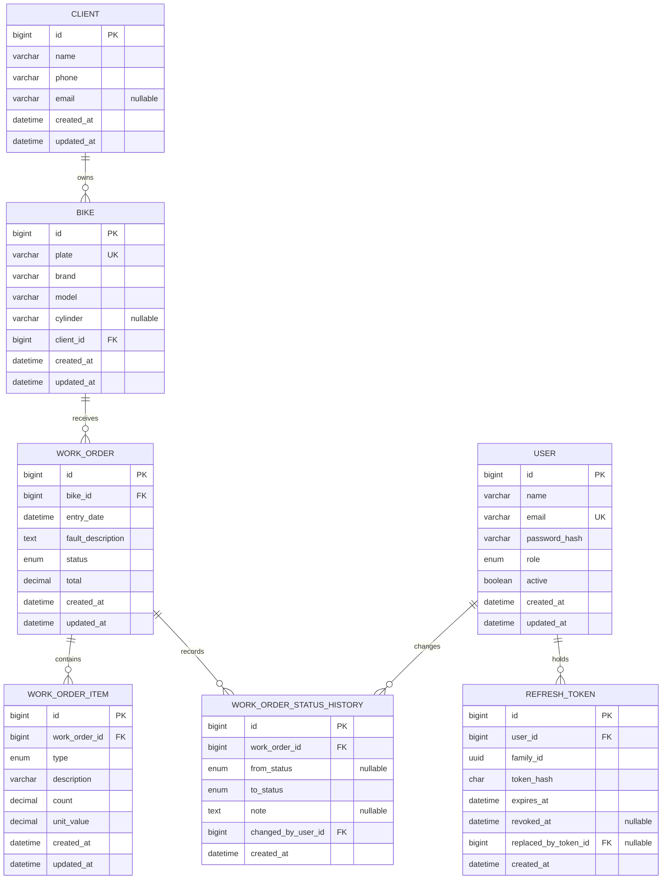

# Database Model

## Status

The Phase 1 physical schema is implemented in HITO 1 for Client, Bike, WorkOrder and WorkOrderItem. Phase 2 entities remain conceptual until their approved milestones.

## Conventions

- MySQL 8 and InnoDB.
- `snake_case` table and column names.
- `BIGINT UNSIGNED` auto-increment primary keys.
- Foreign keys enforced by the database.
- Money stored as `DECIMAL(15,2)`, never binary floating point.
- Item quantity stored as `DECIMAL(10,2)` to support both discrete parts and fractional labor hours.
- Schema changes applied only through deterministic migrations.
- Timestamps stored consistently and exposed as ISO 8601 values.

## Entity relationship diagram



The diagram includes the full target domain. Phase 1 migrations are the source of truth for the four implemented tables.

## Client

| Column | Conceptual type | Rules |
|---|---|---|
| `id` | BIGINT UNSIGNED | PK, auto increment |
| `name` | VARCHAR(150) | required |
| `phone` | VARCHAR(30) | required |
| `email` | VARCHAR(254) | nullable |
| `created_at` | DATETIME(3) | required |
| `updated_at` | DATETIME(3) | required |

Relationship: one client owns many bikes.

## Bike

| Column | Conceptual type | Rules |
|---|---|---|
| `id` | BIGINT UNSIGNED | PK, auto increment |
| `plate` | VARCHAR(20) | required, normalized, UNIQUE `uq_bikes_plate` |
| `brand` | VARCHAR(100) | required |
| `model` | VARCHAR(100) | required |
| `cylinder` | VARCHAR(50) | nullable |
| `client_id` | BIGINT UNSIGNED | FK `fk_bikes_client` to `clients.id`, required |
| timestamps | DATETIME(3) | required |

The model setter trims, uppercases and removes whitespace before persistence. The database unique index remains authoritative. HITO 2 will map duplicate persistence errors to the API contract; no country-specific regex is assumed.

## WorkOrder

| Column | Conceptual type | Rules |
|---|---|---|
| `id` | BIGINT UNSIGNED | PK, auto increment |
| `bike_id` | BIGINT UNSIGNED | FK `fk_work_orders_bike` to `bikes.id`, required |
| `entry_date` | DATETIME(3) | required |
| `fault_description` | TEXT | required |
| `status` | ENUM | canonical status values, required |
| `total` | DECIMAL(15,2) | required, backend-controlled, default `0.00` |
| timestamps | DATETIME(3) | required |

Relationships: one bike has many work orders; one work order has many items and history records.

## WorkOrderItem

| Column | Conceptual type | Rules |
|---|---|---|
| `id` | BIGINT UNSIGNED | PK, auto increment |
| `work_order_id` | BIGINT UNSIGNED | FK `fk_work_order_items_order` to `work_orders.id`, required |
| `type` | ENUM | `MANO_OBRA` or `REPUESTO` |
| `description` | VARCHAR(255) | required |
| `count` | DECIMAL(10,2) | CHECK `chk_work_order_items_count_positive`: greater than zero |
| `unit_value` | DECIMAL(15,2) | CHECK `chk_work_order_items_unit_value_nonnegative`: greater/equal zero |
| timestamps | DATETIME(3) | required |

`DECIMAL(15,2)` supports exact monetary values up to 9,999,999,999,999.99, which is comfortably above assessment-scale Colombian-peso work orders. `DECIMAL(10,2)` permits fractional quantities without forcing binary floating-point arithmetic.

## Phase 1 referential policy

All Phase 1 foreign keys use:

```text
ON DELETE RESTRICT
ON UPDATE CASCADE
```

`RESTRICT` prevents removing a client, bike or order while dependent operational/history-bearing data exists. `CASCADE` on key update keeps references consistent, although primary-key updates are not part of the application workflow. No aggressive delete cascade is introduced.

## Phase 1 migrations

The schema is created in dependency order:

```text
202608240001-create-clients.js
202608240002-create-bikes.js
202608240003-create-work-orders.js
202608240004-create-work-order-items.js
```

Umzug executes ESM migrations and records them in `SequelizeMeta`. Each migration provides `up` and `down`. Sequelize `sync` is not used.

## User

| Column | Conceptual type | Rules |
|---|---|---|
| `id` | BIGINT | PK |
| `name` | VARCHAR | required |
| `email` | VARCHAR | normalized, required, UNIQUE |
| `password_hash` | VARCHAR | required, never serialized |
| `role` | ENUM | `ADMIN` or `MECANICO` |
| `active` | BOOLEAN | required |
| timestamps | DATETIME | required |

## WorkOrderStatusHistory

| Column | Conceptual type | Rules |
|---|---|---|
| `id` | BIGINT | PK |
| `work_order_id` | BIGINT | FK to `work_orders.id`, required |
| `from_status` | ENUM | nullable only for initial event |
| `to_status` | ENUM | required |
| `note` | TEXT | nullable |
| `changed_by_user_id` | BIGINT | FK to `users.id`, required |
| `created_at` | DATETIME | required, immutable |

Required index:

```text
(work_order_id, created_at DESC, id DESC)
```

The source-required `(work_order_id, created_at DESC)` prefix is preserved; `id DESC` provides deterministic ordering for timestamp ties. There are no update or delete history endpoints.

Work-order creation in the final Phase 2 system atomically creates `NULL -> RECIBIDA` with the authenticated creator. This interprets the source field “from_status nullable para el primer estado” explicitly and traceably.

## RefreshToken

| Column | Conceptual type | Rules |
|---|---|---|
| `id` | BIGINT | PK |
| `user_id` | BIGINT | FK to `users.id`, required |
| `family_id` | UUID/CHAR | required session-family identifier |
| `token_hash` | CHAR/VARCHAR | deterministic secure digest, required |
| `expires_at` | DATETIME | required |
| `revoked_at` | DATETIME | nullable |
| `replaced_by_token_id` | BIGINT | self-FK, nullable |
| `created_at` | DATETIME | required |

Raw refresh tokens are never persisted. Rotation retains the family identifier. Reuse of a rotated/revoked token revokes active tokens in that family.

## Database environments

Development uses `pavas_workshop`; integration tests use `pavas_workshop_test`. The implemented guard requires `NODE_ENV=test`, requires a name explicitly containing `test`, and rejects the development target. Integration tests apply and revert the full migration stack and close Sequelize connections. See [testing.md](testing.md).
